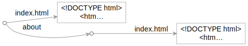
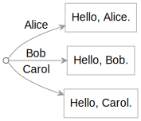

This page introduces the Origami command line interface, which lets you:

- **easily call JavaScript from the shell**. You can invoke functions, pass arguments (including files or folder trees), and capture output as files. You can quickly experiment, test, or do ad hoc operations from the shell.
- **manipulate hierarchies, graphs, and other data** representable in the [Explorable](/core/explorable.html) graph interface — including data files, file system folders, JavaScript objects, and web resources.

This page introduces the basics of ori by demonstrating useful actions you can perform with it. You can follow along with these examples on your own machine.

## Start

Start a terminal window running a shell — the examples here use `bash`. You'll need [node](https://nodejs.org) installed.

**Global installation:** Installing ori globally will make it easier to invoke it in the rest of this tutorial:

```console
$ npm install -g @explorablegraph/explorable
```

_Reviewer's note: during development of ori, it's part of a larger repository of Explorable Graph work. Eventually, it will be published on its own._

To confirm the installation, invoke ori with no arguments.

```console
$ ori
```

This should display the list of [built-in functions](/ori/builtins.html) included with ori.

**Local installation:** As an alternative to global installation, run `npm install` without the `-g` global flag inside a new directory. Because ori won't be available everywhere, wherever the instructions below refer to ori, use Node's [npx](https://docs.npmjs.com/cli/v7/commands/npx) command to invoke ori:

```console
$ npm install @explorablegraph/explorable
$ npx ori
```

## Unpack some files

You can use ori itself to copy sample files used in this introduction into a new local folder called `samples`:

```console
$ ori copy https://explorablegraph.org/samples/cli.yaml, files/samples
$ cd samples
$ ls
double.js      letters.json   sample.txt     text.js
greet.js       package.json   site.yaml      uppercase.js
greetings.yaml people.yaml    template.js
```

Note the comma after the URL — ori is invoking a function called [copy](/ori/builtins.html#copy) that takes two arguments which must be separated with a comma.

The new `samples` folder should show a small collection of files. (The specific files may differ slightly from what's shown above.) ori treated the indicated file as a graph — more on graphs later. The `copy` function read values out of that graph and wrote them into the destination graph: a file system (`files`) folder called `samples`.

If you prefer, you can wrap ori function arguments in parentheses — but since command shells typically interpret parentheses, you may have to quote them:

```console
$ ori "copy(https://explorablegraph.org/samples/cli.yaml, files/samples)"
```

The expression parser in ori makes parentheses implicit, so in many cases you don't have to type them. There are some cases where parentheses are necessary; you'll see an example of that later.

## Display a file from the file system

From inside the `samples` folder:

```console
$ cat sample.txt
This is a text file.
$ ori sample.txt
This is a text file.
```

At this basic level, ori behaves like the `cat` command, but it can handle more than just files.

When you invoke ori:

1. It parses its arguments as an expression.
2. It evaluates that expression, looking up identifiers in the current scope (defined below).
3. If the value of the expression is a JavaScript module, ori imports the module and obtains its default export. If it's a JavaScript function, ori executes it.
4. It displays the result.

Here ori parses the expression `sample.txt` as an identifier. In JavaScript, `sample.txt` is not a valid identifier because it contains a period, but ori's expression parser can recognize file names as identifiers. ori looks up that identifier in the current _scope_. By default, the scope includes:

- the files in the current folder
- the functions exported by JavaScript modules in the current folder
- the functions built into ori

In this case, ori finds that "sample.txt" is the name of a file, and reads that file from the current folder. The file's contents become the result of the expression, which ori then renders to the console.

## Invoke a function

If you ask ori for the sample file `greet.js`, it returns the contents of that file:

```console
$ ori greet.js
export default (name = "world") => `Hello, ${name}.`;
```

If you leave off the `.js` extension, ori _invokes_ the function exported by that file:

```console
$ ori greet
Hello, world.
```

Or, with explicit parentheses:

```console
$ ori "greet()"
Hello, world.
```

When you ask ori to evaluate `greet`:

- It looks for a file called `greet` but doesn't find one.
- ori tries adding `.js` to see if `greet.js` exists. This time it finds a JavaScript module with that name.
- ori dynamically imports the module and obtains the default export (a function).
- Because the result is a JavaScript function, ori executes it.
- The function's result is the string "Hello, world.", which ori displays.

## Pass a string to a function

You can pass arguments to JavaScript functions from the shell:

```console
$ ori "greet('Alice')"
Hello, Alice.
```

ori accepts strings in single quotes. The double quotes shown above are parsed by the _shell_, and are necessary because the `bash` shell shown here would otherwise prevent ori from seeing the single quotes.

In the explorable graph paradigm discussed later, any function can be treated like a graph, and vice versa. This means you can use path syntax as a convenient alternative to specify a string argument:

```console
$ ori greet/Alice
Hello, Alice.
```

In this path syntax, the first path segment (`greet`) will be looked up in the current scope. All subsequent path segments (like `Alice`) are used as is. Otherwise, both ways of passing arguments behave the same.

ori lets you call a JavaScript function like `greet` from the shell without needing to write JavaScript code to parse command line arguments.

## Aside: Loading functions as ES modules

The `samples` folder you're working in includes a file called `package.json` that instructs Node to load `.js` files as ES (EcmaScript) modules:

```console
$ ori package.json
{
  "comment": "This file exists to tell Node to load .js files as ES modules",
  "type": "module"
}
```

By default, Node imports .js files as CommonJS modules. To allow ori to dynamically import JavaScript files in your own projects as ES modules, you will need to include a `package.json` file in the folder with your .js file or in any parent folder. That `package.json` should include the entry `"type": "module"`.

## Use ori as a general-purpose JavaScript shell tool

Suppose you have a collection of functions:

```console
$ ori double.js
export default (x) => `${x}${x}`;
$ ori greet.js
export default (name = "world") => `Hello, ${name}. `;
$ ori uppercase.js
export default (x) => x.toString().toUpperCase();
```

You can then use ori to mix and match these functions from the shell:

```console
$ ori greet
Hello, world.
$ ori uppercase/hi
HI
$ ori greet uppercase/there
Hello, THERE.
$ ori uppercase greet
HELLO, WORLD.
$ ori double greet
Hello, world. Hello, world.
$ ori double greet uppercase/there
Hello, THERE. Hello, THERE.
```

Here are the equivalent verbose forms with parentheses:

```console
$ ori "greet()"
Hello, world.
$ ori "uppercase('hi')"
HI
$ ori "greet(uppercase('there'))"
Hello, THERE.
$ ori "uppercase(greet())"
HELLO, WORLD.
$ ori "double(greet())"
Hello, world. Hello, world.
$ ori "double(greet(uppercase('there')))"
Hello, THERE. Hello, THERE.
```

ori lets you use the shell as a basic JavaScript console, so you can invoke and compose functions in any combination without having to write permanent code. This can be useful when you're experimenting, testing, or need to do one-off operations from the shell.

## Read files with ori

You can feed a file to a JavaScript function:

```console
$ ori sample.txt
This is a text file.
$ ori uppercase.js
export default (x) => x.toString().toUpperCase();
$ ori uppercase sample.txt
THIS IS A TEXT FILE.
```

This lets you pass files to your JavaScript functions without you having to write code to deal with files.

In this example, ori ends up passing a file buffer to the `uppercase` function. The `uppercase` function includes a `toString()` call which here will extract the text from the file buffer. It can then do its uppercasing work on the resulting text.

## Reading input from stdin

You can pipe data into JavaScript functions with the built-in `stdin` function:

```console
$ echo This is input from the shell | ori uppercase stdin
THIS IS INPUT FROM THE SHELL
```

The result of the `stdin` function will be the complete standard input fed to the ori command. This lets you pipe data to a JavaScript function that accepts a simple argument instead of needing specialize the function specifically to read data from the console.

## Writing output to a file

You can use regular shell features to pipe the output from your JavaScript functions to a file:

```console
$ ori sample.txt
This is a text file.
$ ori uppercase sample.txt > uppercase.txt
$ ori uppercase.txt
THIS IS A TEXT FILE.
```

## Explorable graphs

ori is especially good at dealing with graphs. One way to define a graph is in [YAML](https://yaml.org/) format.

```console
$ ori greetings.yaml
{{ samples/cli.yaml/greetings.yaml }}
```

ori can interpret this file as the following graph:

<div>
{{ svg samples/cli.yaml/greetings.yaml }}
</div>

More specifically, ori is designed to work with _explorable graphs_: a graph that can tell you what's in it, and can be either synchronous or asynchronous. Many common data structures can be represented as explorable graphs.

The YAML data format shown above can be easier for people to read than formats like JSON. If you prefer, you can just as easily use the ubiquitous JSON format.

ori itself natively understands several types of explorable graphs:

- JSON
- YAML
- JavaScript objects
- JavaScript arrays
- JavaScript functions
- folder trees
- web sites (some operations require support for [.keys.json](/ori/.keys.json) files, discussed later)
- any object that implements the [Explorable](/core/explorable.html) interface

## Extract specific values out of a graph

You can use path syntax to extract a specific value from a graph.

```console
$ ori greetings.yaml/Alice
Hello, Alice.
```

The `greetings.yaml` graph is a flat list, but it can be a hierarchical tree or arbitrarily complex.

An explorable graph can also be invoked like a function, so you also have the option of using function call syntax:

```console
$ ori "greetings.yaml('Alice')"
Hello, Alice.
```

You can easily combine ori features like JSON/YAML parsing, path syntax, and function invocation to have ori parse a specific value out of a graph and feed that directly to your function.

```console
$ ori uppercase greetings.yaml/Alice
HELLO, ALICE.
```

## Translate JSON to YAML and vice versa

You can use ori to transform a graph from one format to another. By default, ori renders graphs in YAML format, but you can ask for JSON format with the `json` function:

```console
$ ori greetings.yaml
{{ samples/cli.yaml/greetings.yaml }}$ ori json greetings.yaml
{{ json samples/cli.yaml/greetings.yaml }}
```

In the other direction, you can render a JSON file as YAML with the [yaml](/ori/builtins.html#yaml) function:

```console
$ ori letters.json
{{ samples/cli.yaml/letters.json }}$ ori yaml letters.json
{{ yaml samples/cli.yaml/letters.json }}
```

The `json` function isn't a specific YAML-to-JSON transformation; it can transform any graph to JSON text. Similarly, `yaml` can transform any graph to YAML text.

## Parse JSON/YAML files

You can use ori to parse a JSON or YAML file into a plain JavaScript object that your JavaScript function can then handle.

Suppose you have a focused function that does something with a flat, plain object. Perhaps it returns the text of an object's values:

```console
$ ori text.js
export default function text(obj) {
  return Object.values(obj).join("\t");
}
```

You can use the built-in `plain` function to convert a YAML file to a plain JavaScript object, then pass that to the sample `text` function:

```console
$ ori text plain greetings.yaml
Hello, Alice.   Hello, Bob.     Hello, Carol.
```

Or pass a parsed JSON file to your function:

```console
$ ori text plain letters.json
The letter A    The letter B    The letter C
```

Separating the parsing from your function like this lets you keep your function as general as possible.

## Render the current file system tree as a graph

The file system is just another graph that ori natively understands. If you give ori a path to a folder, it will treat that as a graph. For example, you can specify the current folder with a period (`.`):

```console
$ ori .
```

This will render the complete contents of the current folder, including subfolders, in YAML.

You can capture that result to package up the current folder as a YAML file.

```console
$ ori . > package.yaml
```

Or package the folder as JSON:

```console
$ ori json . > package.json
```

## Unpack files into the file system

This ori introduction began with you unpacking a YAML file into separate files. As another example, you can unpack the greetings in `greetings.yaml` into individual files:

```console
$ ori greetings.yaml
Alice: Hello, Alice.
Bob: Hello, Bob.
Carol: Hello, Carol.
$ ori copy greetings.yaml, files/greetings
$ ls greetings
Alice   Bob     Carol
$ cat greetings/Alice
Hello, Alice.
```

The `files/greetings` argument indicates that [copy](/ori/builtins.html#copy) should copy the input YAML graph to a file system graph under a folder named `greetings`. As a result, the key/value pairs in the YAML file are now individual files in a `greetings` folder.

The important point here is that _all graphs look the same to ori_. It doesn't matter whether a graph is defined in a single file like YAML, or a collection of loose files in the file system. Having unpacked the `greetings.yaml` file above, we can ask ori to display the `greetings` folder we just created:

```console
$ ori greetings
Alice: Hello, Alice.
Bob: Hello, Bob.
Carol: Hello, Carol.
```

It _looks_ like `greetings` is a YAML file, but it's not — it's really a folder. ori is just displaying the folder's contents in the default YAML output format. Each line of that output is actually coming from a different file.

The `greetings` folder and the `greetings.yaml` file both define the same graph, even though the underlying data is stored in completely different ways and accessed via different APIs.

## Process a folder tree as a JavaScript object

Because the `greetings` folder created in the above example is just another graph ori can process, you can feed it to the simple JavaScript function `text(obj)` shown earlier that displayed the text values of a plain JavaScript object.

```console
$ ori text plain greetings
Hello, Alice.   Hello, Bob.     Hello, Carol.
```

This connects two ideas:

- A folder like `greetings` is a explorable graph ori can understand.
- ori to convert any graph to a plain JavaScript object with the `plain` function.

This means that you can use the `plain` function to convert a _folder_ to a plain JavaScript object too. The keys will be the file/folder names, and the values will be the file contents or folder subgraphs.

Writing code to work with folder and files this way can be much easier than using Node's file system API directly. There is a performance trade-off implied by building an in-memory object to hold the file system data, but in many cases this is still very fast. And in practice it can much easier to manipulate a complete file system hierarchy as an in-memory object than working with a file system API.

Another important benefit of working with explorable graphs is that you can change your mind later about how you want to represent data without having to rewrite code that processes that data. You could start a small project by representing data in a single file and then, if your needs change later, switch to representing that data in a hierarchical tree of files, or data stored as web resources.

## Serve a graph

You can serve any graph with the [serve](/ori/builtins.html#serve) function. For example, the sample `site.yaml` file defines a tiny graph with two web pages:

```console
$ ori site.yaml
index.html: |
  <!DOCTYPE html>
  <html>
    <body>
      <h1>Index</h1>
      <a href="about/">About</a>
    </body>
  </html>

about:
  index.html: |
    <!DOCTYPE html>
    <html>
      <body>
        <h1>About</h1>
        <p>This site is defined in a YAML file.</p>
      </body>
    </html>
```

The graph looks like this:



You can serve this tiny site directly from the file:

```console
$ ori serve site.yaml
Server running at http://localhost:5000
```

If you open the indicated URL in your browser, you'll be able to browse between the two pages in the site. The YAML file defines a graph, and the server translates each HTTP URL into a graph traversal.

Press Ctrl+C to stop the server.

## Serve a folder

You can serve any graph. To serve the current folder:

```console
$ ori serve .
Server running at http://localhost:5000
```

This effectively lets ori work as a static file server.

As a shorthand, you can omit the period (`.`). If you don't specify a graph to serve, `serve` serves up the current folder.

```console
$ ori serve
Server running at http://localhost:5000
```

## Transform data into something presentable with a template

Template languages are useful for translating data into something you can present to a user. As a bare-bones template language, let's look at a function that renders HTML using a native JavaScript template literal:

```console
$ ori template.js
export default (body) => `<!DOCTYPE html>
<html>
  <head>
    <style>
      body {
        font-family: Zapfino, Segoe Script, cursive;
        color: darkred;
        font-size: 48px;
      }
    </style>
  </head>
  <body>
    ${body}
  </body>
</html>
`;
```

We can use ori to apply this template to data, potentially plucked out of a graph, to render that data as HTML:

```console
$ ori template greetings.yaml/Alice
<!DOCTYPE html>
<html>
  <head>
    <style>
      body {
        font-family: Zapfino, Segoe Script, cursive;
        color: darkred;
        font-size: 48px;
      }
    </style>
  </head>
  <body>
    Hello, Alice.
  </body>
</html>
```

You could save this output as an HTML file and open it in your browser, or in a minute you'll see another way to view such a page directly.

## Transform a whole graph of stuff

Earlier you saw an `uppercase` function that takes a string argument and returns an uppercase version:

```console
$ ori uppercase greetings.yaml/Alice
HELLO, ALICE.
```

You can apply that `uppercase` transformation to an entire graph with the ori's built-in `map` function:

```console
$ ori "map(greetings.yaml, uppercase)"
Alice: HELLO, ALICE.
Bob: HELLO, BOB.
Carol: HELLO, CAROL.
```

It is easy to transform an entire explorable graph of one type of object into a new graph of a different type of object. You only need to identify or define a one-to-one transformation function that handles a single object, and ori can apply that as a many-to-many transformation of an entire graph.

The second argument to `map` is a function. (Technically, the second argument can be any explorable graph, but for the moment, we'll use a regular JavaScript function.) We want to treat that function as a first-class object, which means we _don't_ want ori to do its normal implicit function invocation here. To prevent that, you must include the parentheses by quoting the arguments to ori or otherwise escaping them.

The `map` example above takes the original greetings graph:



and creates a new graph where all the values are uppercase:


In this intro, we're just transforming text, but you can transform anything in bulk, including images and other binaries. If you can write a function to transform a single thing in JavaScript, you can use ori to apply that transformation to an entire graph of things.

## Traversing a transformed graph

If you ask for a specific value from a `map` graph, then only that value is computed:

```console
$ ori "map(greetings.yaml, uppercase)/Alice"
HELLO, ALICE.
```

`map` doesn't do all its work when invoked, but immediately returns a new explorable graph that will invoke the mapping function on demand. You can think of such an explorable graph as a _lazy dictionary_. The lazy dictionary doesn't have a permanent entry for "Alice", but if you ask for "Alice", the lazy dictionary will go and compute the desired value.

## Use a graph as a map

Suppose that you have base data, like an array of people:

```console
$ ori people.yaml
- Alice
- Carol
```

And some other data that associates a person's name with a greeting:

```console
$ ori greetings.yaml
Alice: Hello, Alice.
Bob: Hello, Bob.
Carol: Hello, Carol.
```

You can then treat both the base data and the greetings data as graphs, and pass those to `map`, to turn the list of specific people into a list of greetings:

```console
$ ori "map(people.yaml, greetings.yaml)"
- Hello, Alice.
- Hello, Carol.
```

Above it was noted that the second argument passed to `map` can actually be any graph, not just a mapping function. This lets you use data to transform other data. Here the second `greetings.yaml` graph is used as a function to transform the individual names coming from `people.yaml` into greetings.

## Serve a transformed graph of stuff

You can ask ori to serve data transformed on demand into HTML using `map` and the template we saw earlier.

```console
$ ori "serve map(greetings.yaml, template)"
Server running at http://localhost:5000
```

The served site does _not_ have an index page, but you can browse to one of the defined pages like http://localhost:5000/Alice. You'll see "Hello, Alice." rendered in HTML. Due to the lazy nature of explorable graphs and `map`, that rendering work is only done on request.

## Turn a transformed graph of stuff into files

You can transform a graph and save the results as files.

```console
$ ori "copy map(greetings.yaml, template), files/html"
$ ls html
Alice   Bob     Carol
```

If you serve the `html` folder now, the user experience will be the same as when the HTML pages were generated dynamically by `map`:

```console
$ ori serve html
Server running at http://localhost:5000
```

You can perform a `copy` operation like the one in this example in preparation for deploying HTML pages to a static web server. The web page you're reading right now was created and deployed in exactly that way.

## Inspect a live web site

The web site you're reading now supports viewing its contents as an explorable graph, so you can reference it directly in ori. For example, this site includes a route [/samples/greetings/](/samples/greetings/), and you can pass that URL to ori to view the files there:

```console
$ ori https://explorablegraph.org/samples/greetings/
Alice: Hello, Alice.
Bob: Hello, Bob.
Carol: Hello, Carol.
```

While that result may look like a YAML file, each of those lines is actually coming from a separate web resource.

```console
$ ori https://explorablegraph.org/samples/greetings/Alice
Hello, Alice.
```

ori can discover all the resources at the `/samples/greetings/` route because this server supports a simple protocol: for every route on this server, a `.keys.json` file exists that enumerates the resources at that route.

```console
$ ori https://explorablegraph.org/samples/greetings/.keys.json
["Alice","Bob","Carol"]
```

When you ask to view a route, ori asks that server for its `.keys.json` file, then uses that information to traverse all the resources at that route.

Making the full contents of a site more freely available might be concerning to some people, but most web content is already available to users; it's just not conveniently inspectable. ori extends the spirit of the browser's View Source feature, which looks at a single web page at a time, to let you inspect everything at a particular web route.

## Create a web site mirror

Since a web site like explorablegraph.org is an explorable graph, and ori can serve explorable graphs, then you can easily set up a local mirror for this site:

```console
$ ori serve https://explorablegraph.org
Server running at http://localhost:5000
```

Your local server is now mirroring the explorablegraph.org site: when you browse your local site, the local server gets the necessary resources from the original site, then re-serves them at the local address.

## Copy a live web site to local files

You can also use ori to copy an explorable web route to local files:

```console
$ ori copy https://explorablegraph.org/samples/greetings/, files/snapshot
$ ls snapshot
Alice Bob   Carol
```

While some people may balk at letting people freely copy web resources to their own machine, there are plenty of cases where the entire point of the site is to make information freely available.

Of course, just because copying a site is possible doesn't mean it's efficient. If you regularly need to copy web resources to local files, there are faster tools for that job. But if you only do that infrequently, the general-purpose ori may suffice.

## Finish

This concludes the ori introduction. As you've seen, ori is useful for

- invoking JavaScript functions from the shell
- parsing arguments from the command line and passing those to JavaScript functions
- passing files and folder trees to JavaScript functions
- capturing function output to files
- working with graphs defined in JSON/YAML files, the file system, or web sites

If you installed ori globally at the start of this introduction, but won't use ori after this, now is a good time to uninstall it and clean up:

```console
$ cd ..
$ rm -r samples
$ npm uninstall -g @explorablegraph/explorable
```

If you installed ori without the `-g` global flag, you can just delete the directory you were working in.

_Reviewer's note: Feel free to experiment further with ori if you'd like, but understand that it's not yet stable and will likely undergo further change. Anyone interested in using it should be in contact with [@JanMiksovsky](https://twitter.com/JanMiksovsky), and at this stage should be prepared to participate in the project at some level beyond just filing bug reports and expecting those bugs to be fixed._
