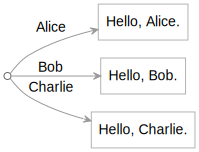
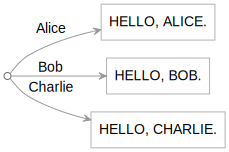

<style>
body {
  counter-reset: h2;
}

h2:before {
  counter-increment: h2;
  content: counter(h2) ". ";
}
</style>

`eg` is a multi-purpose command line tool that:

- bridges the shell and JavaScript, so you can easily invoke JavaScript from the command line, pass files to JavaScript functions, and freely mix shell tools and JavaScript.
- manipulates data representable in the [Explorable](/explorable) graph interface, such as JSON and YAML files, file system folders, JavaScript objects, and web resources.

This page introduces the basics of `eg` by demonstrating useful actions you can perform with it. You can follow along with these examples on your own machine.

## Start

Start a terminal window running a shell — the examples here use `bash`. You'll need [node](https://nodejs.org) installed.

To install `eg` on your machine:

```sh
$ npm install -g @explorablegraph/explorable
```

_Reviewer's note: during development of `eg`, it's part of a larger repository of Explorable Graph work. Eventually, it will be published on its own._

To confirm the installation, invoke `eg` with no arguments.

```sh
$ eg
```

This should display a list of pre-installed `eg` commands.

## Unpack some files

One task `eg` can perform is unpacking the values of a JSON or YAML file into a folder tree, so let's use that now to obtain sample files for the examples that follow:

```sh
$ eg copy https://explorablegraph.org/samples/eg.yaml, files/samples
$ cd samples
$ ls
```

Note the comma after the URL — the `copy` command takes two arguments that must be separated with a comma.

The new `samples` folder should show a small collection of files. `eg` treated the indicated YAML file as a graph (more on graphs later). The `copy` function read values out of that graph and wrote them into the file system graph.

If you prefer, you can wrap `eg` function arguments in parentheses — but since command shells typically interpret parentheses, you may have to quote them:

```sh
$ eg "copy(https://explorablegraph.org/samples/eg.yaml, files/samples)"
```

The expression parser in `eg` makes parentheses implicit, so in many cases you don't have to type them. There are some cases where parentheses are necessary; you'll see an example of that later.

## Display a file from the file system

At its core, `eg` exists to bridge the shell and JavaScript. When you invoke `eg`, it:

1. Parses its arguments as an expression
2. Evaluates that expression, looking up identifiers in the current scope (defined below)
3. If the value of an identifier is a JavaScript module, `eg` imports the module and obtains its default export. If it's a JavaScript functions, `eg` executes it
4. Displays the result

From inside the `samples` folder:

```sh
$ eg sample.txt
This is a text file.
```

Here, `eg` parsed the expression `sample.txt` as an identifier, and looked that up in the current _scope_. By default, the scope includes:

- the files in the current folder
- the functions exported by JavaScript modules in the current folder
- functions built into `eg`

In this case, "sample.txt" is the name of a file, so `eg`reads that file from the current folder, and the contents become the result of the expression.`eg` then renders that result to the console.

At this basic level, `eg` is effectively a tool for displaying files like the Unix `cat` command.

## Invoke a function

One of the sample files is a JavaScript function:

```sh
$ eg greet.js
export default (name = "world") => `Hello, ${name}.`;
```

When you ask `eg` to evaluate "greet.js", it looks up that key in the current scope and displays the contents of the indicated JavaScript file. But if you leave off the `.js` extension, `eg` _invokes_ that function.

```sh
$ eg greet
Hello, world.
```

When you ask `eg` to evaluate "greet":

- It will not find a file called "greet", so `eg` looks next to see if "greet.js" exists.
- This time it finds a JavaScript module with that name. `eg` dynamically imports the module and obtains its default export.
- The exported result is a JavaScript function, which `eg` executes.
- The function's result is the string "Hello, world.", so `eg` displays that.

## Pass a string to a function

You can pass arguments to JavaScript functions from the shell. One way is to quote the argument(s) to `eg`:

```sh
$ eg "greet('Alice')"
Hello, Alice.
```

`eg` accepts strings in single quotes or backticks, but _not_ double quotes. The double quotes shown above are parsed by the _shell_, and are necessary because the `bash` shell shown here would otherwise prevent `eg` from seeing the single quotes.

In the explorable graph paradigm discussed later, a function is also a graph and vice versa. This means you can use path syntax as a convenient alternative to specify a string argument to a function:

```sh
$ eg greet/Alice
Hello, Alice.
```

In this path syntax, all path keys after the first slash are implicitly quoted.

Regardless of which syntax you use, `eg` lets you invoke JavaScript functions like `greet` from the shell without the function itself having to parse command line arguments. Among other things, this can let you directly test a function that's normally invoked in some other way.

## Aside: Loading functions as ES modules

The above definition of `greet.js` is an ES (EcmaScript) module that exports a function using standard JavaScript `export` syntax. By default, Node imports .js files as CommonJS modules. To allow `eg` to dynamically import JavaScript files as ES modules, you will need to include a `package.json` file in the folder with your .js file or in any parent folder. That `package.json` should include the entry `"type": "module"`:

The `samples` folder you're working in already includes a minimalist `package.json` file with such an entry:

```sh
$ eg package.json
{
  "comment": "This file exists to tell Node to load .js files as ES modules",
  "type": "module"
}
```

If you want to use `eg` in a JavaScript project of your own, you'll need to create a `package.json` file that contains such a `"type": "module"` entry.

## Use `eg` as a general-purpose JavaScript shell tool

`eg` lets you invoke and compose functions in any combination without having to write permanent code. This can be useful when you're experimenting or need to do one-off operations from the shell.

Suppose you have a collection of functions:

```sh
$ eg double.js
export default (x) => `${x}${x}`;
$ eg greet.js
export default (name = "world") => `Hello, ${name}. `;
$ eg uppercase.js
export default (x) => x.toString().toUpperCase();
```

You can then use `eg` to mix and match these functions from the shell:

```sh
$ eg greet
Hello, world.
$ eg uppercase/hi
HI
$ eg greet uppercase/there
Hello, THERE.
$ eg uppercase greet
HELLO, WORLD.
$ eg double greet
Hello, world. Hello, world.
$ eg double greet uppercase/there
Hello, THERE. Hello, THERE.
```

If it helps to visualize these examples using parentheses, here are the equivalent verbose form with quotes:

```sh
$ eg "greet()"
Hello, world.
$ eg "uppercase('hi')"
HI
$ eg "greet(uppercase('there'))"
Hello, THERE.
$ eg "uppercase(greet())"
HELLO, WORLD.
$ eg "double(greet())"
Hello, world. Hello, world.
$ eg "double(greet(uppercase('there')))"
Hello, THERE. Hello, THERE.
```

At this level, `eg` lets you use the shell as a basic JavaScript console.

## Read files with `eg`

You can use `eg` to feed files to your JavaScript functions without your having to write code to deal with files. When you reference a file in an expression,`eg` loads its contents from the local graph (the current folder). At that point it can feed the file contents to a function you specify.

```sh
$ eg sample.txt
This is a text file.
$ eg uppercase sample.txt
THIS IS A TEXT FILE.
```

Note that the argument `sample.txt` is _not_ quoted, as you want to let `eg` evaluate it.

In this example, `eg` ends up passing a file buffer to the `uppercase` function. The `uppercase` function includes a `toString()` call which here will extract the text from the file buffer. It can then do its uppercasing work on the resulting text.

## Reading input from stdin

You can pipe data into JavaScript functions with the built-in `stdin` function:

```sh
$ echo This is input from the shell | eg uppercase stdin
THIS IS INPUT FROM THE SHELL
```

The result of the `stdin` function will be the complete standard input fed to the `eg` command.

## Writing output to a file

You can use regular shell features to pipe the output from your JavaScript functions to a file:

```sh
$ eg uppercase sample.txt > uppercase.txt
$ eg uppercase.txt
THIS IS A TEXT FILE.
```

## Explorable graphs

`eg` is generally useful as a way to invoke JavaScript from the shell, but it's especially good at dealing with graphs. More specifically, `eg` is designed to work with _explorable graphs_: a type of graph that can tell you what's in it, and can be either synchronous or asynchronous. Many common data structures can be represented as explorable graphs.

Let's start with a simple YAML file:

```sh
$ eg greetings.yaml
Alice: Hello, Alice.
Bob: Hello, Bob.
Carol: Hello, Carol.
```

`eg` can model this file as explorable graph:



`eg` natively understands a number of graph formats:

- JSON
- YAML
- JavaScript objects
- JavaScript arrays
- JavaScript functions
- folder trees
- web sites (some operations require support for [.keys.json](/eg/.keys.json) files)
- any object that implements the [Explorable](/explorable) interface

## Extract specific values out of a graph

You can use path syntax to extract a specific value from a graph.

```sh
$ eg greetings.yaml/Alice
Hello, Alice.
```

An explorable graph can also be invoked like a function, so you also have the option of using function call syntax:

```sh
$ eg "greetings.yaml('Alice')"
Hello, Alice.
```

You can easily combine `eg` features like JSON/YAML parsing, path syntax, and function invocation to have `eg` parse a specific value out of a graph and feed that directly to your function.

```sh
$ eg uppercase greetings.yaml/Alice
HELLO, ALICE.
```

## Translate JSON to YAML and vice versa

`eg` can serve as a way of transforming a graph from one format to another. By default, `eg` renders graphs in YAML format, a superset of JSON which can be easier to read. If you prefer JSON format, you can ask for that with the `json` function:

```sh
$ eg greetings.yaml
Alice: Hello, Alice.
Bob: Hello, Bob.
Carol: Hello, Carol.
$ eg json greetings.yaml
{
  "Alice": "Hello, Alice.",
  "Bob": "Hello, Bob.",
  "Carol": "Hello, Carol."
}
```

In the other direction, you can render a JSON file as YAML with the `yaml` function:

```sh
$ eg letters.json
{
  "a": "The letter A",
  "b": "The letter B",
  "c": "The letter C"
}
$ eg yaml letters.json
a: The letter A
b: The letter B
c: The letter C
```

## Parse JSON/YAML files

You can use `eg` to parse a JSON or YAML file into a plain JavaScript object that your JavaScript function can then handle, relieving you of parsing work.

Suppose you have a focused function that does something with a flat, plain object. Perhaps it returns the text of an object's values:

```sh
$ eg text.js
export default function text(obj) {
  return Object.values(obj).join("\t");
}
```

You can use the built-in `plain` function to convert a YAML file to a plain JavaScript object, then pass that to the sample `text` function:

```sh
$ eg text plain greetings.yaml
Hello, Alice.   Hello, Bob.     Hello, Carol.
```

Or pass a parsed JSON file to your function:

```sh
$ eg text plain letters.json
The letter A    The letter B    The letter C
```

Separating the parsing from your function like this lets you keep your function as general as possible.

## Render the current file system tree as a graph

The file system is just another graph that `eg` natively understands. If you give `eg` a path to a folder, it will treat that as a graph. For example, you can specify the current folder with `.`:

```sh
$ eg .
```

This will render the complete contents of the current folder, including subfolders, in YAML.

You can capture that result to package up the current folder as a YAML file.

```sh
$ eg . > package.yaml
```

Or package the folder as JSON:

```sh
$ eg json . > package.json
```

## Unpack files into the file system

You already saw the unpacking of a YAML file into separate files at the start of this `eg` introduction.

As another example, you can unpack the greetings in `greetings.yaml` into individual files:

```sh
$ eg greetings.yaml
Alice: Hello, Alice.
Bob: Hello, Bob.
Carol: Hello, Carol.
$ eg copy greetings.yaml, files/greetings
$ ls greetings
Alice   Bob     Carol
$ cat greetings/Alice
Hello, Alice.
```

The key/value pairs in the YAML file are now individual files in the file system.

The important point here is that _all graphs look the same to `eg`_. It doesn't matter whether a graph is defined in a single file like YAML, or a collection of loose files in the file system. Having unpacked the `greetings.yaml` file above, we can ask `eg` to display the `greetings` folder we just created:

```sh
$ eg greetings
Alice: Hello, Alice.
Bob: Hello, Bob.
Carol: Hello, Carol.
```

It _looks_ like `greetings` is a YAML file, but it's not — it's really a folder. `eg` is just displaying the folder's contents in the default YAML output format. Each line of that output is actually coming from a different file.

The `greetings` folder and the `greetings.yaml` file both define the same graph, even though the underlying data is stored in completely different ways and accessed via different APIs.

## Process a folder tree as a JavaScript object

In the example above, you saw how a folder like `greetings` is just another graph that `eg` can process. Let's connect that idea to the earlier demonstration of using `eg` to convert a JSON/YAML graph to a plain JavaScript object with the `plain` function. Since all graphs are the same to `eg`, that means that we can use `plain` to convert a _folder_ to a plain JavaScript object too.

Earlier you saw a simple JavaScript function `text(obj)` that displayed the text values of a plain JavaScript object. This can be applied to the `greetings` folder too:

```sh
$ eg text plain greetings
Hello, Alice.   Hello, Bob.     Hello, Carol.
```

Writing code to work with folder and files this way can be much easier than using Node's file system API directly. There is obviously a trade-off in performance, but in many cases this can be fast enough.

## Serve a graph

You can serve any graph with the `serve` function, which starts a local web server.

For example, the sample `site.yaml` file contains a tiny graph with two web pages:

```sh
$ eg site.yaml
index.html: |
  <!DOCTYPE html>
  <html>
    <body>
      <h1>Index</h1>
      <a href="about/">About</a>
    </body>
  </html>

about:
  index.html: |
    <!DOCTYPE html>
    <html>
      <body>
        <h1>About</h1>
        <p>This site is defined in a YAML file.</p>
      </body>
    </html>
```

You can serve this tiny site directly from the file:

```sh
$ eg serve site.yaml
Server running at http://localhost:5000
```

If you open the indicated URL in your browser, you'll be able to browse between the two pages in the site. The YAML file defines a graph, and the server translates each HTTP URL into a graph traversal.

Press Ctrl+C to stop the server.

You can serve any graph. To serve the current folder:

```sh
$ eg serve .
Server running at http://localhost:5000
```

This effectively lets `eg` work as a static file server.

There are a number of ways to combine graphs of different types to create a web site based on a combination of in-memory objects, functions, local files, and server resources.

## Transform data into something presentable with a template

Template languages are useful for translating data into something you can present to a user. As a bare-bones template language, let's look at a function that renders HTML using a native JavaScript template literal:

```sh
$ eg template.js
export default (body) => `<!DOCTYPE html>
<html>
  <head>
    <style>
      body {
        font-family: Zapfino, Segoe Script, cursive;
        color: darkred;
        font-size: 48px;
      }
    </style>
  </head>
  <body>
    ${body}
  </body>
</html>
`;
```

We can use `eg` to apply this template to data, potentially plucked out of a graph, to render that data as HTML:

```sh
$ eg template greetings.yaml/Alice
<!DOCTYPE html>
<html>
  <head>
    <style>
      body {
        font-family: Zapfino, Segoe Script, cursive;
        color: darkred;
        font-size: 48px;
      }
    </style>
  </head>
  <body>
    Hello, Alice.
  </body>
</html>
```

You could save this output as an HTML file and open it in your browser, or in a minute you'll see another way to view such a page directly.

## Transform a whole graph of stuff

It is easy to transform an entire explorable graph of one type of object into a new graph of a different type of object. You only need to identify or define a one-to-one transformation function that handles a single object, and `eg` can apply that as a many-to-many transformation of an entire graph.

Earlier you saw an `uppercase` function that takes a string argument and returns an uppercase version:

```sh
$ eg uppercase greetings.yaml/Alice
HELLO, ALICE.
```

You can apply that `uppercase` transformation to an entire graph with the `eg`'s built-in `map` function:

```sh
$ eg "map(greetings.yaml, uppercase)"
Alice: HELLO, ALICE.
Bob: HELLO, BOB.
Carol: HELLO, CAROL.
```

The second argument to `map` is a function. (Technically, that argument can be any explorable graph, but for the moment, we'll use a regular JavaScript function.) We want to treat that function as a first-class object, which means we _don't_ want `eg` to do its normal implicit function invocation here. To prevent that, you must include the parentheses, which generally requires quoting the arguments to `eg` or otherwise escaping them.

In any event, this `map` takes the original greetings graph


and creates a new graph where all the values are uppercase:



In this intro, we're just transforming text, but you can transform anything in bulk, including images and other binaries. If you can write a function to transform a single thing in JavaScript, you can use `eg` to apply that transformation to an entire graph of things.

Significantly, `map` doesn't do all its work when invoked, but immediately returns a new explorable graph that will invoke the mapping function on demand. You can think of such an explorable graph as a _lazy dictionary_. The lazy dictionary doesn't have a permanent entry for "Alice", but if you ask for "Alice", the lazy dictionary will go and compute the desired value.

In this `uppercase` example, `eg` does end up doing all the `uppercase` work — but only because we're asking `eg` to display the complete results. If you ask for a specific value, then only that value is computed:

```sh
$ eg "map(greetings.yaml, uppercase)/Alice"
HELLO, ALICE.
```

## Use a graph as a map

Above it was noted that the mapping function passed to `map` can actually be any graph. This lets you use data to transform other data.

Suppose that you have base data, like an array of people:

```bash
$ eg people.yaml
- Alice
- Carol
```

And some other data that associates a person's name with a greeting:

```bash
$ eg greetings.yaml
Alice: Hello, Alice.
Bob: Hello, Bob.
Carol: Hello, Carol.
```

You can then treat both the base data and the greetings data as graphs, and pass those to `map`, to turn the list of specific people into a list of greetings:

```bash
$ eg "map(people.yaml, greetings.yaml)"
- Hello, Alice.
- Hello, Carol.
```

Here the second `greetings.yaml` graph is used as a function to transform the individual names coming from `people.yaml` into greetings.

## Serve a transformed graph of stuff

We can ask `eg` to serve HTML created using `map` and the template we saw earlier.

```sh
$ eg "serve map(greetings.yaml, template)"
Server running at http://localhost:5000
```

The served site does _not_ have an index page, but you can browse to one of the defined pages like http://localhost:5000/Alice. You'll see "Hello, Alice." rendered in HTML. Due to the lazy nature of explorable graphs and `map`, that rendering work is only done on request.

## Turn a transformed graph of stuff into files

You can transform a graph and save the results as a new graph. For example, instead of serving a set of templated web pages, we can render them as files by copying the lazy dictionary defined by `map`.

```sh
$ eg "copy map(greetings.yaml, template), files/html"
$ ls html
Alice   Bob     Carol
```

You can do such a `copy` operation in preparation for deploying HTML pages to a static web server. The web page you're reading right now was created and deployed in exactly that way.

## Inspect a live web site

Using `eg` to work with graphs at a high level means that many tasks which were previously tedious or difficult can become easy.

For example, it's generally not easy today to immediately see the complete contents of a web site. But if a web site is modeled as an explorable graph, and the server follows a simple protocol for implementing the Explorable interface, viewing a portion of a site (or the entire site) becomes trivial.

The web site you're reading now supports viewing its contents as an explorable graph, so you can reference it directly in `eg`. For example, this site includes a route /samples/greetings, and you can view the files there just by passing that URL to `eg`:

```sh
$ eg https://explorablegraph.org/samples/greetings/
Alice: Hello, Alice.
Bob: Hello, Bob.
Carol: Hello, Carol.
```

While that result may look like a YAML file, each of those lines is actually coming from a separate web resource.

```bash
$ eg https://explorablegraph.org/samples/greetings/Alice
Hello, Alice.
```

`eg` can discover all the resources at the `/samples/greetings/` route because this server supports a simple protocol: for every route on this server, a `.keys.json` file exists that enumerates the resources at that route.

```sh
$ eg https://explorablegraph.org/samples/greetings/.keys.json
["Alice","Bob","Carol"]
```

When you ask to view a route, `eg` asks that server for its `.keys.json` file, then uses that information to traverse all the resources at that route.

Making the full contents of a site more freely available might be concerning to some people, but most web content is already available to users; it's just not conveniently inspectable. `eg` extends the spirit of the browser's View Source feature, which looks at a single web page at a time, to let you inspect everything at a particular web route.

## Create a web site mirror

Since a web site like explorablegraph.org is an explorable graph, and `eg` can serve explorable graphs, then you can easily set up a local mirror for this site:

```sh
$ eg serve https://explorablegraph.org
Server running at http://localhost:5000
```

Your local server is now mirroring the explorablegraph.org site: when you browse your local site, the local server gets the necessary resources from the original site, then re-serves them at the local address.

## Copy a live web site to local files

You can also use `eg` to copy an explorable web route to local files:

```bash
$ eg copy https://explorablegraph.org/samples/greetings, files/snapshot
$ ls snapshot
Alice Bob   Carol
```

Of course, just because this is possible doesn't mean it's efficient. If you regularly need to copy web resources to local files, there are faster tools for that job. But if you only do that infrequently, the general-purpose `eg` may suffice.

## Finish

This concludes the `eg` introduction.

If you're finished and won't use `eg` after this, now is a good time to uninstall it and clean up:

```sh
$ cd ..
$ rm -r samples
$ npm uninstall -g @explorablegraph/explorable
```
