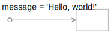
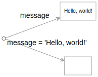
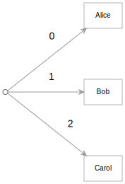

Egret is a framework for transforming digital content — data, files, and other resources — into forms that can be viewed and used by your audience. It's built on a conceptual paradigm for considering common development tasks that can be translated directly into an efficient language for describing what you want.

This introduction walks you through the practical example of creating a simple About Us area for a hypothetical organization. To lay the groundwork for that, let's begin with some "Hello, world" exercises of basic Egret features.

## Start

pika copy stuff locally
or launch StackBlitz

## Start a local server

There are a variety of ways to incorporate Egret or its output into an existing web server or a larger project, but for this introduction, you'll use the server built into the companion [pika](/pika) command-line tool.

Open a terminal window in the project's root directory, then run the following command:

```console
$ pika serve
Server running at http://localhost:5000
```

You should be able to open http://localhost:5000 and see a listing of the project files. At the moment, all of the files you see are regular files in the file system.

## Create a formula

The Egret framework lets you quickly create virtual files and folders by writing formulas. You write those formulas in the _file names_ of real files.

In a code editor, open the sample project and view the contents of the `hello` folder. This folder is initially empty.

In the `hello` folder, create a new, empty file with the following name:

```console
message = 'Hello, world!'
```

The file name should be that whole formula, including the `=` sign and the single quotes.

- The left-hand side of the formula defines the name of a virtual file, `message`.
- The right-hand side is an expression that will be evaluated to determine the value or contents of that virtual file. Here the virtual `message` file will be a text string.
- The file name itself is sufficient to define the behavior. The file itself can be empty, although it may also contain useful information that can be processed by the formula.

Without needing to do anything else, point your browser at http://localhost:5000/hello. You should now see a listing that includes:

1. the real file you just created with the formula name
1. the virtual `message` file implied by that formula

If you click on the name of that `message` file, you will navigate to a page called http://localhost:5000/hello/message that says "Hello, world!"

The pika `serve` command you issued earlier is aware of Egret formulas. The server will parse file names that contain formulas with an `=` sign and interpret them. You don't have to use that server: you can integrate the support for formulas into other servers like Express. Later you'll also see how to dispense with a live server entirely by building static files that can be hosted anywhere.

## Conceptualizing real files and virtual files as graphs

The Egret framework and the pika command line tool use the same formula language. In addition to viewing the result of a formula in the browser as you did above, at any time you can also view the value of a formula in the command line with the pika tool.

In the terminal, change to the `hello` directory and run these commands:

```console
$ ls
message = 'Hello, world!'
$ pika files
"message = 'Hello, world!'": ""
```

The pika `files` function returns a graph of the real files in the current folder. The `hello` folder only contains one real file called `message = 'Hello, world!'`. If you ask pika to display the local `files` graph, it will list (in YAML form) the single real file and indicate that it is empty (`""`).

You can visualize the `files` graph as a node (the folder) that points to a single value (an empty file).



If you ask pika to render the local `app` graph, it interprets any formulas and returns both real and virtual files.

```console
$ pika app
message: Hello, world!
"message = 'Hello, world!'": ""
```

In this case, the `app` graph includes: 1) the virtual `message` file whose contents are "Hello, world!", and 2) the empty real file whose file name implies the creation of the virtual file. This virtual `app` graph looks like:



This virtual `app` graph was created by transforming the real `files` graph above. During this transformation, the presence of a real file with a formula for its name implied the existence of a virtual file.

_Transforming graphs is the fundamental operation of the Egret framework._

The `files` graph is your starting point: the real files you create by transcribing the ideas and information in your head or gathering data from elsewhere. Through a series of transformations, you create a final virtual graph that represents the artifact you wish your audience to view or use.

Before moving on: since the pika tool knows how to traverse graphs, you can do things like ask pika to display a single virtual file from the `app` graph:

```console
$ pika app/message
Hello, world!
```

In the steps that follow, you will define formulas that dynamically create data and HTML pages. At any point you can view those in the browser, or use pika to view those virtual files in the command line.

We'll come back to graph transformations, but first let's create some more interesting formulas.

## Invoke a JavaScript function from a formula

In the same `hello` folder, creating a JavaScript file called `greet.js` and paste in the following:

```js
// greet.js
export default (name = "world") => `Hello, <strong>${name}</strong>!`;
```

This function generates an HTML fragment that greets a person by name if a name is supplied (or just says "Hello, world!" if no name is given).

You can use this `greet` formula in an Egret function to generate the contents of a virtual file.

As before, create a new file and set its name to the entire formula below:

```console
hello.html = greet()
```

This will define a virtual file called `hello.html`. The value or contents of that virtual file will be the result of invoking the function exported by the `greet.js` module. Egret follows a convention that `greet` is a reference to the whatever is exported by `greet.js`. In this case, that's a function that can be invoked.

If you open http://localhost:5000/hello/hello.html, you'll now see "Hello, **world**!". Each time you ask for `hello.html`, the web server will evaluate the formula you defined.

And as before, you can view the contents of this HTML page in the command line:

```console
$ pika app/hello.html
Hello, <strong>world</strong>!
```

## Pass an argument to a function

You can pass arguments to function like `greet`. In the same `hello` folder, create a new file called:

```console
alice.html = greet('Alice')
```

Be sure to use single quotes, not double quotes. To encourage cross-platform compatibility with Microsoft Windows — which does not allow double quotes in file names — Egret doesn't recognize double quotes.

You should now be able to open http://localhost:5000/hello/alice.html to see "Hello, **Alice**!"

Since the function the formula calls is regular JavaScript, you can use that JavaScript to create HTML by any means you like. If the function is asynchronous, Egret will `await` the result before serving it to the browser. With that, you should be able to do essentially anything you want in the JavaScript function to create any HTML result.

A function like `greet` here is essentially transforming a single piece of data from one form (a string) into a different form — HTML intended for presentation. But the function and the formula that invokes it could just as easily be transforming the data into other forms; there's nothing special about HTML here.

## Transform a graph

If you want to create a greeting page for several people, you could create a formula for each of them like the one for `alice.html` above. But you can also write formulas that transform a set of things at once.

Create a new file called `team.yaml` and enter an array of names:

```yaml
- Alice
- Bob
- Carol
```

If you prefer JSON, you can go through this exercise by creating a `team.json` file instead:

```json
["Alice", "Bob", "Carol"]
```

Since YAML is a little easier to read and write by hand, the rest of this introduction will use YAML.

Either way, the data file defines an array. We can visualize that array as a graph:



In Egret, a graph is a first-class data type, so you can transform a graph like this with a formula. Create a new empty file called:

```console
greetings = map(team.yaml, greet)
```

The [map](/pika/builtins.html#map) function is a built-in function that applies a one-to-one map function like `greet` to a graph of object. The result is a new graph of transformed objects. In this case, the `greet` function maps a string to an HTML fragment. Using `map` to apply `greet` to an array of strings will produce a graph of HTML fragments.

If you open http://localhost:5000/hello/, you'll see a new entry for a virtual `greetings` folder. If you click on that `greetings` name, you'll see a list of three links labeled with the indices of the array: "0", "1", "2". Clicking on one of those indices will take you to a page like http://localhost:5001/src/step2/greetings/1, which says "Hello, **Bob**!"

Your `greetings` formula transforms the array in `team.yaml` into a new graph of HTML greetings pages.


The `map` function, and the graphs used by Egret generally, are _lazy_. They only do work when they need to. Unlike a JavaScript [Array map](https://developer.mozilla.org/en-US/docs/Web/JavaScript/Reference/Global_Objects/Array/map), the `map` function here does not do any mapping work upon invocation — it only does the work when someone requests the mapped graph's keys or values. The `greetings` graph represents _potential_ work.

In this case, the HTML greeting for a person like Carol is only generated when you actually try to visit that URL.

Although this graph is essentially flat — it has only level of values, graphs in Egret can be arbitrarily deep. A `map` applied to a deep graph will return a new, deep graph of transformed values.

You've now seen the basics of Egret: creating virtual files with formulas, invoking JavaScript from formulas, and using formulas to transform graphs.

Next: [Begin tackling a practical example](intro2.html)
