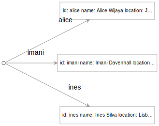
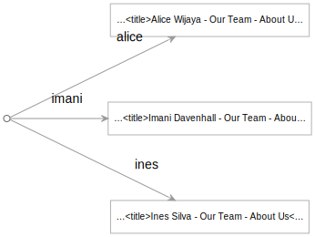

Egret is a framework for transforming digital content — data, files, and other resources — into forms that can be viewed and used by your audience. It's built on a mental framework for considering common development tasks that can be translated directly into a very efficient language for describing what you want.

As a motivating example, this introduction leads you through the following hypothetical design and development task:

> _You've been given the task of designing and developing an "About Us" area for your organization's site. The main About Us page will need to include a list of people on the team, with links to separate pages for each team member. A team member's page should show their position, bio, and a photo._

Before going further, think for a moment about how you would approach this engineering problem. The Egret approach will likely be quite different. Among other things, it will entail writing very little traditional programming code, leaning instead on:

- HTML to describe the structure of the pages
- CSS to define the appearance of pages
- a data file with information about the team in human-readable and -editable form
- templates to transform data to HTML
- and formulas to define the transformations you want

## Start

pika copy stuff locally
or launch StackBlitz

### Start a local server

There are a variety of ways to incorporate Egret or its output into an existing web server or a larger project, but for this introduction, you'll use the server built into the companion [pika](/pika) command-line tool.

Open a terminal window in the project's root directory, then run the following command:

```console
$ pika serve
Server running at http://localhost:5000
```

You should be able to open http://localhost:5000 and see a listing of the project files. At the moment, all of the files you see are regular files in the file system.

## Create virtual files with formulas

The Egret framework lets you quickly create virtual files by putting formulas _in file names_. Before diving into the About Us task, let's warm up by creating some formulas that will transform data in various ways.

In a code editor, open the sample project and view the contents of the `step1` folder. This folder is initially empty.

In the `step1` folder, create a new, empty file with the following name:

```console
message = 'Hello, world!'
```

The file name should be that whole formula, including the `=` sign and the single quotes.

- The left-hand side of the formula defines the name of a virtual file, `message`.
- The right-hand side is an expression that will be evaluated to determine the value or contents of that virtual file. Here the virtual `message` file will be a text string.

Without needing to do anything else, point your browser at http://localhost:5000/step1. You should now see a listing that includes the real file you just created, as well as the virtual `message` file the formula implies.

If you click on the name of that virtual `message` file, you will navigate to a page called http://localhost:5000/step1/message that says "Hello, world!"

The `pika` web server you started earlier is aware of Egret formulas. The server will parse file names that contain formulas with an `=` sign and interpret them. The file name itself is sufficient to define the behavior. The file itself can be empty, although the file itself may also contain useful information used by the formula.

### View the result of a formula in the command line

The Egret framework and the pika command line tool use the same formula language. In addition to viewing the result of a formula in the browser as you did above, at any time you can also view the value of a formula in the command line with the pika tool.

In the terminal, change to the `step1` directory and run this command:

```console
$ ls
message = 'Hello, world!'
$ pika files
"message = 'Hello, world!'": ""
$ pika app
message: Hello, world!
"message = 'Hello, world!'": ""
$ pika app/message
Hello, world!
```

The `step1` folder only contains one real file called `message = 'Hello, world!'`. If you ask pika to display the local `files` graph, it will list (in YAML form) the single real file and indicate that it is empty (`""`).

If you ask pika to render the local `app` graph, however, it will interpret any formulas and return both real and virtual files. In this case, it returns the real file that defines the formula, plus the virtual `message` file whose contents are "Hello, world!"

You can ask pika to display just the virtual file `message` by asking for `app/message`.

In the steps that follow, you will define formulas that dynamically create data and HTML pages. At any point you can view those in the browser, or use pika to view those virtual files in the command line.

## Invoke JavaScript functions

In your code editor, open the `step2` folder. It contains just a JavaScript module, `greet.js`, that defines a "Hello, world" function:

```js
// greet.js
export default (name = "world") => `Hello, <strong>${name}</strong>!`;
```

This function generates an HTML fragment that greets a person by name if a name is supplied (or just says "Hello, world!" if no name is given).

You can use this `greet` formula in an Egret function to generate the contents of a virtual file.

As before, create a new file and set its name to the entire formula below:

```console
hello.html = greet()
```

This will define a virtual file called `hello.html`. The value or contents of that virtual file will be the result of invoking the function exported by the `greet.js` module. Egret follows a convention that `greet` is a reference to the whatever is exported by `greet.js`. In this case, that's a function that can be invoked.

If you open http://localhost:5000/step2/hello.html, you'll now see "Hello, **world**!".

Each time you ask for `hello.html`, the web server will evaluate the formula you defined.

### Pass an argument to a function

You can pass arguments to function like `greet`. Still in the `step2` folder, create a new file called:

```console
alice.html = greet('Alice')
```

Be sure to use single quotes, not double quotes. Because Microsoft Windows does not allow double quotes in file names, Egret doesn't recognize them to encourage cross-platform project compatibility.

You should now be able to open http://localhost:5000/step2/alice.html to see "Hello, **Alice**!"

Since the function the formula calls is regular JavaScript, you can use that JavaScript to create HTML by any means you like. If the function is asynchronous, Egret will `await` the result before serving it to the browser.

## Transform data into HTML with a template

At this point, we're ready to begin transforming content into a form we can present to our site visitors. Using plain JavaScript to create HTML for this could work, but for many cases like this would be overkill.

--> deciding how to represent team member data

The `step3` folder contains two files. The first is a data file called `alice.yaml` containing data for an individual team member named Alice.

```yaml
id: alice
name: Alice Wijaya
location: Jakarta
position: Experience Designer
bio: |
  Alice opens the line of communication between clients, customers, and
  businesses to get projects done. With over 15 years in both public and
  private sectors, she has experience in management consultation, team
  building, professional development, strategic implementation, and company
  collaboration. She has a passion for helping people and businesses succeed,
  and is always looking for ways to improve the world.
```

This data is in [YAML](https://yaml.org/) format because that can be easier for people to read and write directly. If you prefer, you could also use the standard JSON format.

If all you want to do is pour data into a template, a template language can be more appropriate. Egret comes with built-in support for a minimalist template language called [Handlebars](https://handlebarsjs.com) whose focused feature set complements Egret very well. We'll use Handlebars in this introduction. If you prefer a different template language, you can use it with Egret but doing so is beyond the scope of this intro.

The `step3` folder also contains a Handlebars template called `person.hbs` designed to work with the above data schema. The primary user-visible content of that template is as follows:

```handlebars

<h2 class="name">{{name}}</h2>
<div class="position">
  {{position}},
  {{location}}
</div>
<p class="bio">
  {{bio}}
</p>
```

A template is essentially a function for turning data into a text format like HTML, so Egret allows you to invoke a Handlebars template as a function. All you have to do is give that function data to transform.

In the `step3` folder, create a new, empty file called

```console
alice.html = person.hbs(alice.yaml)
```

This formula creates a virtual file called `alice.html`. The contents of that virtual file will be the HTML obtained by applying the `person.hbs` template to the data in `alice.yaml`. In this case, the primary content of the virtual `alice.html` file will be:

```html

<h2 class="name">Alice Wijaya</h2>
<div class="position">Experience Designer, Jakarta</div>
<p class="bio">
  Alice opens the line of communication between clients, customers, and
  businesses to get projects done. With over 15 years in both public and private
  sectors, she has experience in management consultation, team building,
  professional development, strategic implementation, and company collaboration.
  She has a passion for helping people and businesses succeed, and is always
  looking for ways to improve the world.
</p>
```

Open http://localhost:5000/step3/alice.html in your browser to view the result. It will look approximately like this:


--> graph with one key/value
--> transformed graph

At this point, we're successfully transforming the data for a single person, Alice, to create a single web page for that person.

## Transform an entire graph of data into HTML

It's very common to want to transform an entire set of things to create a new set of things. For this sample About Us area, we want to transform a set of data about team members to create a corresponding set of HTML pages — one page for each person.

In the previous `step3` folder, we had data for a single individual, Alice, stored in a file `alice.yaml`.

In the `step4` folder, you'll find a consolidated data file, `team.yaml`, which contains data for 10 team members.

```yaml
alice:
  id: alice
  name: Alice Wijaya
  location: Jakarta
  position: Experience Designer
  bio: |
    Alice opens the line of communication between clients, customers, and
    businesses to get projects done. With over 15 years in both public and
    private sectors, she has experience in management consultation, team
    building, professional development, strategic implementation, and company
    collaboration. She has a passion for helping people and businesses succeed,
    and is always looking for ways to improve the world.
imani:
  id: imani
  name: Imani Davenhall
  location: Los Angeles
  position: President
  bio:
# ... data continues ...
```

Each block of data for an individual person has a key. The field we use for the key could be anything unique; here we'll use some identifier we've designated as safe to make publicly visible, as it will appear in URLs. At the moment, the key we're using (like `alice`) duplicates the value of the `id` field; we can remove the redundancy later.

We can represent the above data set as a graph:



The `step4` folder also contains the same `person.hbs` Handlebars template that can transform the data for a single person into an HTML page for that person. We now want to apply that `person.hbs` template as a function to the entire set of team members.

In the `step4` folder, create a new, empty file called

```console
team = shallowMap(team.yaml, person.hbs)
```

This transforms the above graph of data into a new graph of virtual HTML files:



## Creating an index page

Our site's About Us area now has pages for each team member. The next step will be to link to all those pages from an index page for the About Us area. This index page will list the photos and names of the team members. The listing for each person will link to their corresponding team member page.

To phrase this in graph terms, consider the graph of HTML pages above. The index page will capture the information in the left, circular node. We want to give the index a link corresponding to each of the arrows leading from that node to the pages for team members.

The `step5` folder contains a template for the index page called `index.hbs`. This template expects to be passed a graph of person data — the data in the same `team.yaml` shown above. For each person in that graph, the template will create a list item linking to that person. The relevant portion of the template looks like:

```handlebars
<ul class="tileGrid">
  {{#each this}}
    <li class="tile">
      <a href="team/{{@key}}">
        
        <h2 class="name">{{name}}</h2>
        <div class="position">{{position}}</div>
      </a>
    </li>
  {{/each}}
</ul>
```

You can produce the index page with a formula that applies the `index.hbs` template to the `team.yaml` data. Create a new, empty file called

```console
index.html = index.hbs(team.yaml)
```

You can view that index page at http://localhost:5000/src/step5/. Clicking a person on that page will navigate you to their individual page.

## Building static web pages

```console
$ pika copy app/html, files/dist
```

### Defining the data as an array instead of an object

```console
$ pika addIndex team.yaml, "'name'"
Alice:
  name: Alice
Bob:
  name: Bob
Carol:
  name: Carol
```

## Deploying

## Adding images

## Adding more data
