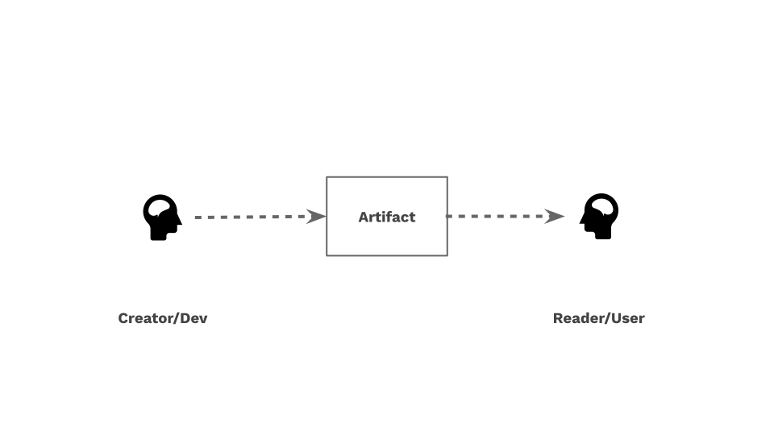
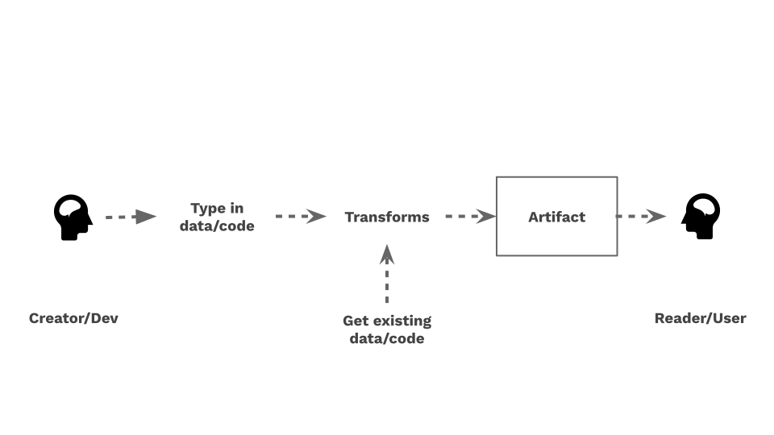

You can approach software design tasks by thinking about _transformation_:

1. What is the final form of the content I want to end up with?
1. What is the best form of the content I can start with?
1. How am I going to transform the starting content into the final content?

Most designers and developers will ultimately touch on these questions, but often don't ask them directly. Doing so can give you a better understanding of what you are trying to do, and thereby help you do whatever it is better and more easily.

Egret is a mental paradigm and programming framework for doing this.

## Task statement

As a motivating example, this introduction leads you through the following hypothetical design and development task:

> _Your team needs to design and implement an "About Us" area for your organization's site. The main About Us page will need to include a list of people on the team, with links to separate pages for each team member. A team member's page should show their position, bio, and a photo._

Before going further, think for a moment about how you would approach this engineering problem. The Egret approach will likely be quite different. Among other things, it will entail writing very little traditional programming code, leaning mostly on:

- HTML to describe the structure of the pages
- CSS to define the appearance of pages
- a data file with information about the team in human-readable and -editable form
- templates to transform data to HTML
- and formulas to define the transformations you want

## Creating things for people





## Final form of the content

## Starting form of the content

Where is the data going to come from?

- Your head. You'll have to type it out.
- Other people's heads. You'll need to ask them for the data.
- documents.
- web pages. Will need to copy it, download it, scrape it, etc.
- APIs

Your goals may include:

- be efficient with time
- be efficient with brainpower
- avoid costs. Someone may offer the exact data you need but charge for it.
- minimize risk. If the data you want to start with exists in an online web page, may be easier to do brute force copy-and-paste than to write code to programmatically scrape it.
- avoid making yourself a bottleneck. Can you put the data somewhere where other people can easily contribute to it?
- ensure clarity, legibility
- minimize maintenance costs
- minimize duplication

These goals may conflict. It may be much simpler to get started by copying and pasting data from existing documents, but this itself is a form of duplication and can create maintenance burdens later on when the source data changes.

Forms of data that are usually easy to work with in JavaScript

- data files: JSON, YAML
- text files

Harder:

- image/audio/video files
- APIs. Authentication, learning curve, resiliency

Hard:

- Spreadsheets
- rich text

## Creating a site's About Us area

1. What is the final form of the content I want to end up with?
1. What is the form of the content I can start with?
1. How am I going to transform the starting content into the end result?

Before going further, think for a moment about how you would approach this engineering problem.

Let's consider these questions in turn.

## Question 2: What is the content's final form?

--> graph diagram

--> index page

--> person page

## Question 1: What is the starting form of the content?

often need to work on both these questions at the same time

small team of 10 people
the team may have some sort of basic cloud-hosted HR or payroll system with names, roles, and a few other bits of data like location
will probably want to convert this to a table
will also need to ask for bios
can put all this into some form that can be easily read programmatically
photo comes separately

--> graph diagram

## Question 3: What transformations need to take place?

Given the initial conception of the starting form of the content and the desired final form, you'll have to conceptually transform this content in several ways

1. Transform the array of person records into a named collection of person records. Will need a unique ID.
1. Transform the person records into an index page. For each person, create a tile representing them and a link to their full bio.
1. Transform an individual person record into HTML.

## A starting point

```console
$ cat team.yaml
- name: Alice
- name: Bob
- name: Carol
```

## An ending point
